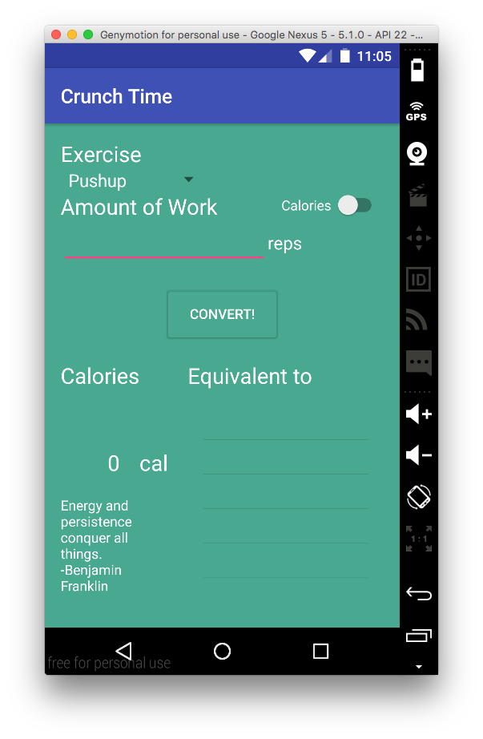

# PROG 01: Crunch Time

Crunch Time motivates you to exercise in different ways. It provides you how much calories you have burned after some exercise. It also provides a list of other exercises with equivalent amount of work calculated based on calories. You can also check how many reps or how much minutes to achieve burning your target calories.

## Authors

FirstName LastName ([kleekich@berkeley.edu](mailto:your_email@berkeley.edu))

## Demo Video

See [your demo video title here] (https://link_to_your_video)

## Screenshots

## Acknowledgments

* Hat tip to anyone who's code was used
* Any other support

*Feel free to enhance your README. For Markdown syntax, see [the GitHub Guides](https://guides.github.com/features/mastering-markdown/). Remove this line in your submission.*
