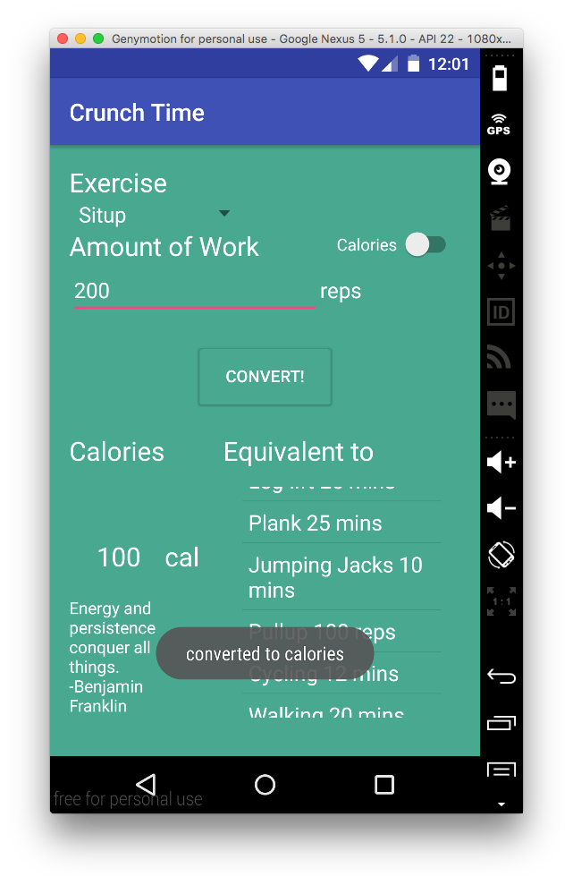

# PROG 01: Crunch Time

Crunch Time motivates you to exercise in different ways. It helps you to achieve your fitness goal more effectively by providing how much calories you have burned after exercise. If you are looking for differnt exercise, do not worry. Crunch Time also provides a list of other exercises with equivalent amount of work calculated based on calories. So, if you think you cannot go for jogging today, Crunch Time suggests you other options to encourage you to keep up with your plan. You can also check how much amount of work you have to achieve to burn your target calories.

## Authors

Kangsik Kevin Lee ([kleekich@berkeley.edu](mailto:your_email@berkeley.edu))

## Demo Video

See [your demo video title here] (https://link_to_your_video)

## Screenshots

